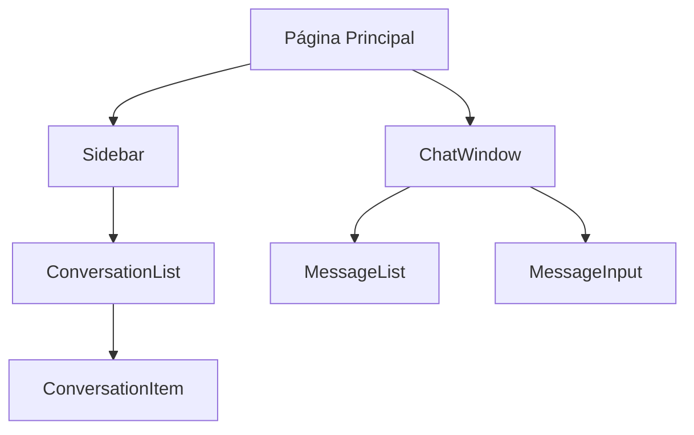

# Chat Inteligente 🤖💬

[](https://nextjs.org/)
[](https://www.typescriptlang.org/)
[](https://tailwindcss.com/)

Interface simples para um chat inteligente com funcionalidades completas de mensagens e gestão de conversas.

## ✨ Funcionalidades Principais

- 🆕 Criação de novas conversas  
- ✏️ Edição em tempo real dos títulos das conversas  
- 💾 Persistência local de mensagens e conversas  
- 🎨 Interface responsiva com temas claro/escuro  
- ⚡ Mensagens em tempo real  
- 🗑️ Exclusão de conversas  
- 📱 Compatível com dispositivos móveis  

## 🛠️ Arquitetura Técnica

### Stack Principal
- **Frontend**: Next.js 15 (App Router)  
- **Estilos**: Tailwind CSS + Shadcn/ui  
- **Gerenciamento de Estado**: Zustand  
- **Tipagem**: TypeScript  

### Diagrama de Componentes


## 🚀 Passos para Execução

1. Clonar o repositório:

    ```bash
    git clone https://github.com/seu-usuario/chat-inteligente.git

2. Instalar as dependências:

    ```bash
    npm install

3. Iniciar o servidor de desenvolvimento:

    ```bash
    npm run dev

4. Abrir no navegador:

    ```bash
    http://localhost:3000

### 📦 Dependências Principais

- next: Framework principal
- zustand: Gerenciamento de estado
- lucide-react: Ícones
- tailwindcss: Estilização
- shadcn/ui: Componentes UI

### 🤝 Boas Práticas Implementadas

- Tipagem rigorosa com TypeScript
- Componentes reutilizáveis
- Hooks personalizados
- Estrutura atômica de componentes
- Interface totalmente responsiva

### 🚧 Próximas Melhoras

- Integração com API de IA
- Sistema de autenticação